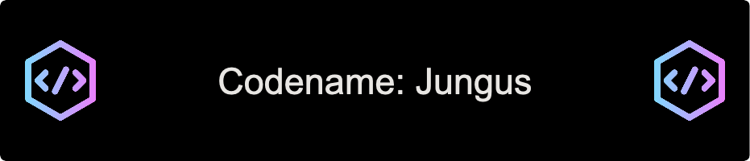

 
<h1 align="center">
  Codename: Jungus
</h1>

  IT System Administrator at SU

  

<h3 align="center">Languages:</h3>

  
  
  
  
  
  
  
  
  

<h3 align="center">Tools:</h3>

  
  
  
  
  
  
  

  

    
    
  

           
  

    
  

   

  <!---->

 

---

 

  
🏫 Graduate classes - UMES

   
  
- Fall 2024
  - CSDP 601 - Analysis and Design of Algorithm
  - CSDP 602 - Database Management Systems

  
🏫 Undergraduate classes - Salisbury University

  
- Fall 2022
  - COSC 426 - Software Engineering II
  - COSC 450 - Operating System

- Spring 2022
  - COSC 425 - Software Engineering I
  - COSC 390 - Undergrad Research Proj (Cyber Security - Infastructure/basic tools)
  - COSC 370 - Computer Networks

- Fall 2021
  - COSC 350 - Systems Software
  - COSC 320 - Advance Data Structures
  - COSC 386 - Database Design & Implementation

- Spring 2021
  - COSC 220 - Computer Science II
  - COSC 362 - Theory of Computation
  - COSC 482 - Computer Graphics (OpenGL)
  - COSC 250 - Microcomputer Organization

- Fall 2020
  - COSC 120 - Computer Science I

